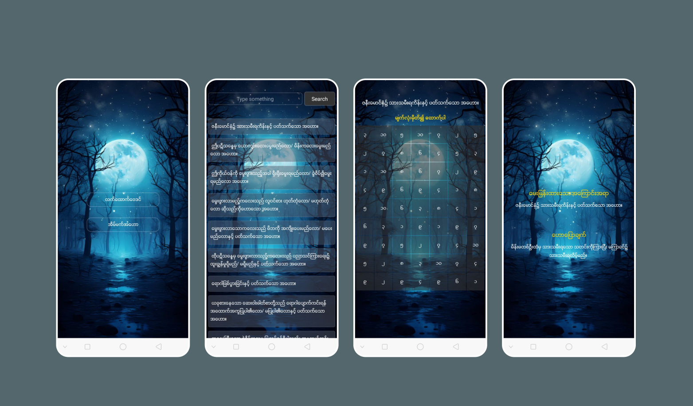
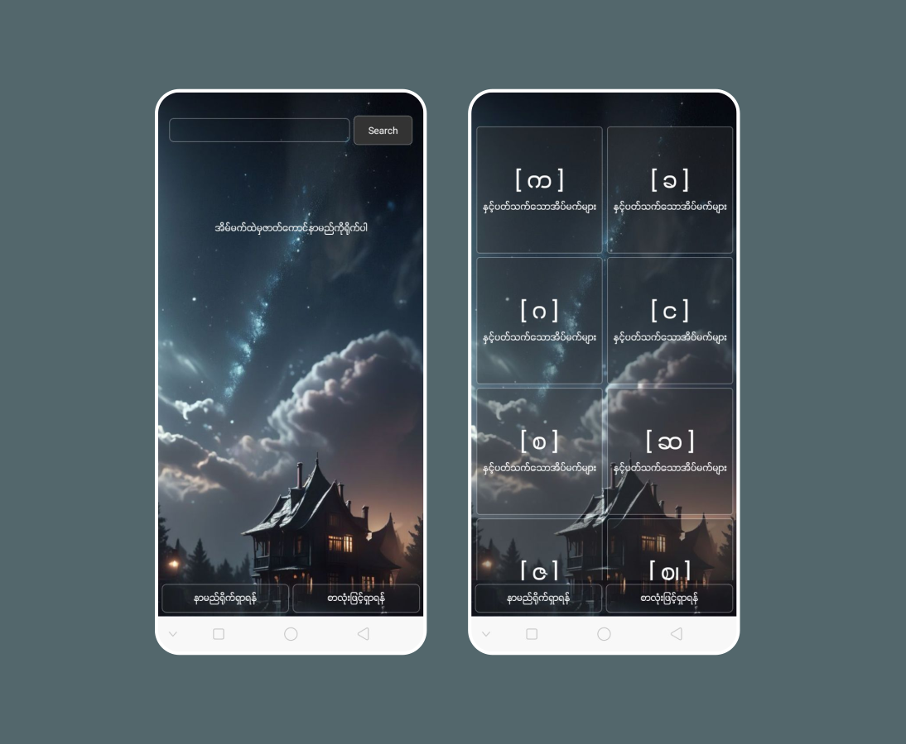

# Baydinsayar App (React native);

 I combined the two projects [Min Thein Kha - Lat Htauk Bay Din](https://github.com/sannlynnhtun-coding/MinTheinKha-LatHtaukBayDin) and [Dream Dictionary](https://github.com/sannlynnhtun-coding/Dream-Dictionary)

thanks to [@sannlynnhtun-coding](https://github.com/sannlynnhtun-coding/) for the project ideas.

## You can download and  review my app
# Android
For arm64-v8a [download](https://drive.google.com/file/d/1ezXV3NK5ZbXXq9RGt_eMkqwZdCosxE_N/view?usp=drivesdk)

For armebi-v7a [download](https://drive.google.com/file/d/1ezYQj5KGrhjNmaL9E_a0o5IvNyisZFRT/view?usp=drivesdk)

## App Screenshots

